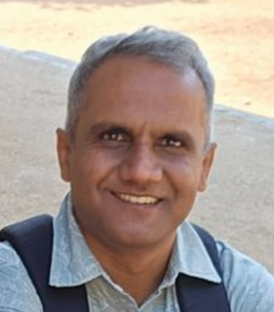
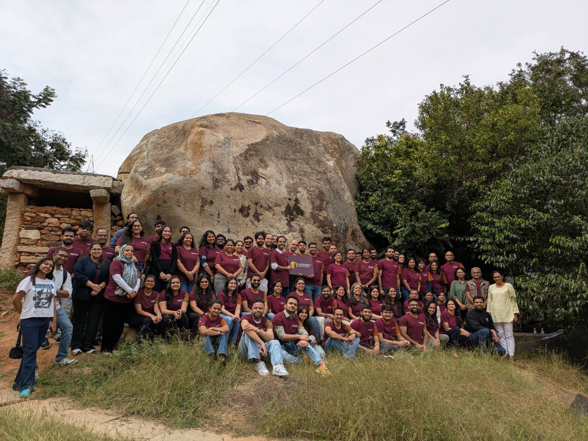

Hello! I am Sandeep Ramdurg.

By core experience, I am a software architect involved in development of
wireless cellualar protocol software. I have served in this area for 20+ years
and I intend to continue contributing in this area with my offerings as a consultant, which I am
since last few years. In parallel, I also aspire to develop understanding and
offer ideas and services in new areas, namely environment, social, and
governance through writings and projects. Below is a summary of my profile and works.

# Core experience (2001-2020)

<!--
- **1997**:- Bachelor of Engineering, Electronics & Communication, 
            P.E.S. College of Engineering, Mysore University, Mandya, India.
- **2001**:- Master of Science, Electrical Communication Engineering,
            Indian Institute of Science, Bengaluru, India.
- **2001-2020**:- 
-->
Served in private companies for 20 years as an embedded software engineer 
and architect in research & development of cellular communication protocol stacks (3G/4G/5G). 
Also contributed majorly in project management, people management, solution building
and pre-sales roles in latter years

[Visit my linkedin page for more details about education and employments](https://www.linkedin.com/in/sandeep-ramdurg/)

<!--
- **2001-2006**: Sasken Communication Technologies India Pvt. Ltd.
- **2006-2008**: Motorola India Pvt. Ltd.
- **2008-2012**: Smartplay Technologies India Pvt. Ltd.
- **2012-2014**: Signalchip Innovations India Pvt. Ltd.
- **2015-2017**: Synapse Design India Pvt. Ltd.
- **2017-2020**: Sasken Technologies India Pvt. Ltd.
-->

# Freelance work... (from 2020)

<!-- ## Interests -->
As a freelance worker, my interest is to consolidate and use my knowledge and experience independently
to help businesses and societies in meaningful ways as below. My interests are:-

**Core**:-
    Create artifacts like trainings, tools, reference designs etc. based on prior experience 
    to enable teams to design and develop wireless telecom stacks;
    Provide support to businesses for project, people, product and services management;
    Provide consulting to analyse and predict trends in wireless telecom landscape;
    Perform research to create content (paper, ideas, opinion, policy etc.);

**Environment/Societal**:-
    Analyse and report environmental, social and governance (ESG) problems prevalent in India;
    Propose, plan and execute ESG projects for corporates as part of CSR initiatives;
    Analyse or propose public policy in the areas of technology and ESG;
    Participate in social and political movements for empowerments of the economically and socially weak communities;

Following memberships, certifications, publications and projects have been pursued in freelance mode. 

## Memberships
- **07.2022**:- [Fellow, Institute of Electronics & Telecommunication Engineers (IETE), India](./assets/memberships/iete.png), Membership No. F-503318

## Certifications
- **12.2026**:- [Graduate Certificate in Public Policy (Advanced Public Policy)](./assets/certifications/gcpp.png), Takshashila Institute, Bengaluru

*GCPP Batch42 workshop group photo, Dec06 2025*

- **03.2027 (planned)**:- IICA Certified CSR Professional (ICP-CSR), Indian Institute of Corporate Affairs (IICA), New Delhi

## Presentations/Publications

- [Recommendations for Policy on “Prevention & Regulation of Online Gaming”](./assets/publications/online_gaming.pdf);
    Policy Analysis, Submitted to Takshashila Institute as final project work for award of degree;
    01.01.2026

- [Ramping up adoption of Public Internet in India](./assets/publications/public-wifi.pdf);
    Opinion Piece, Submitted to Takshashila Institute as public engagement exercise for award of degree;
    28.12.2025

- [Relieving India's Language Stress](./assets/publications/language_policy.pdf);
    Policy Proposal, Submitted to Takshashila Institute as public engagement exercise for award of degree;
    22.12.2025

- [Reasons for environmental non-compliances in urban areas](./assets/publications/2024_02_02_mohua_appeal_PAPER-FINAL.pdf);
    Policy Proposal, Submitted to the Urban Development Department, Government of Karnataka, 
    as a grievance and proposal;
    07.02.2024

- [Policy for roll out PMWANI public wifi in India](./assets/publications/policy_v1.0.pdf); 
    Policy Paper, Prepared for internal use by company for roll out of PMWANI public wifi; 
    31.10.2022

## Projects/Consulting

**04.2025 to Present:- Self-engaged to build service offerings in core and social areas of work** \
*(Working on acquiring certifications, Learning/refreshing old and new engineering subjects, Practising developing protocol code)*

**04.2024 to 03.2025:- Consulting Software Architect at Semiksha Semiconductors** \
*(Architected NBIOT L2L3 protocol stack for junior team and developed the interfaces/seed code and provided trainings and mentoring to ramp up the team to build protocol stack independently on the provided architecture. Also, supported in defining the rest of architecture for the L1 modules and L1-RF interfacing)*

**09.2020 to 03.2024:- Founder & Managing Director, CP-Enrich Services & Solution Pvt. Ltd.** \
*(Was solely involved in company formation and execution of projects under company head upto 03.2023. The company was thereafter resolved for closing due to lack of clear business case and also to avoid compliance overheads in the absence of business visibility)*

- **01.2022 to 03.2023:- PM-WANI Public WiFi licensee** \
*(Acquired PM-WANI aggregator license for company, and conceptualized and architected the policy and scheme for roll of PM-WANI public WiFi under the brandname WiFi-Pravaah. Attempted to secure partnerships with telecom operators for deployments. On not being able to create suffience traction for scheme amongst public and operators, the project was closed down)*

- **09.2020 to 12.2021:- Consultant to BLRlabs. Deputed to Alif Semiconductors** \
*(Managed project for a team of around 35 members delivering the CatM and NBIoT L1 software out of India for the SoC team working out of US)*

